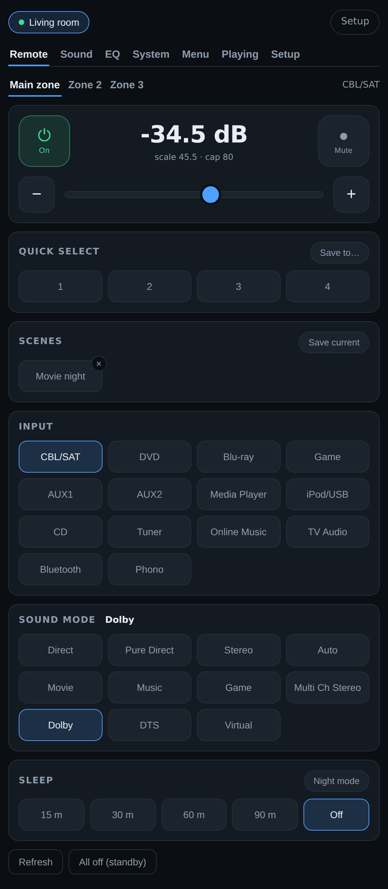
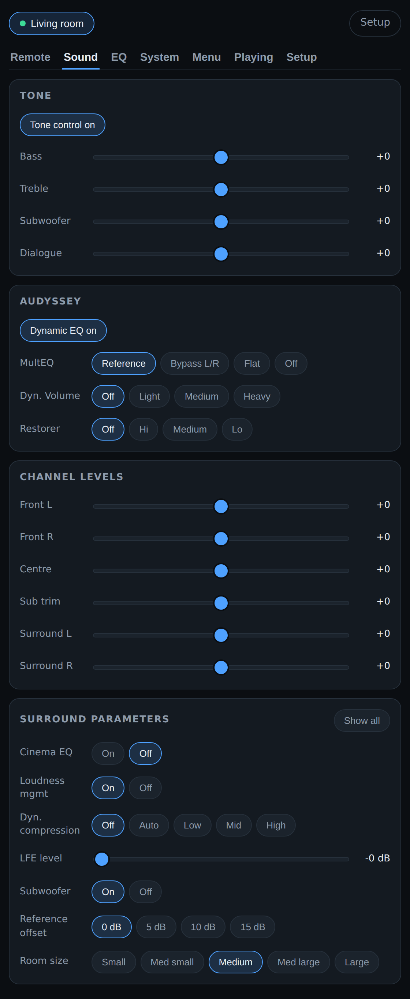
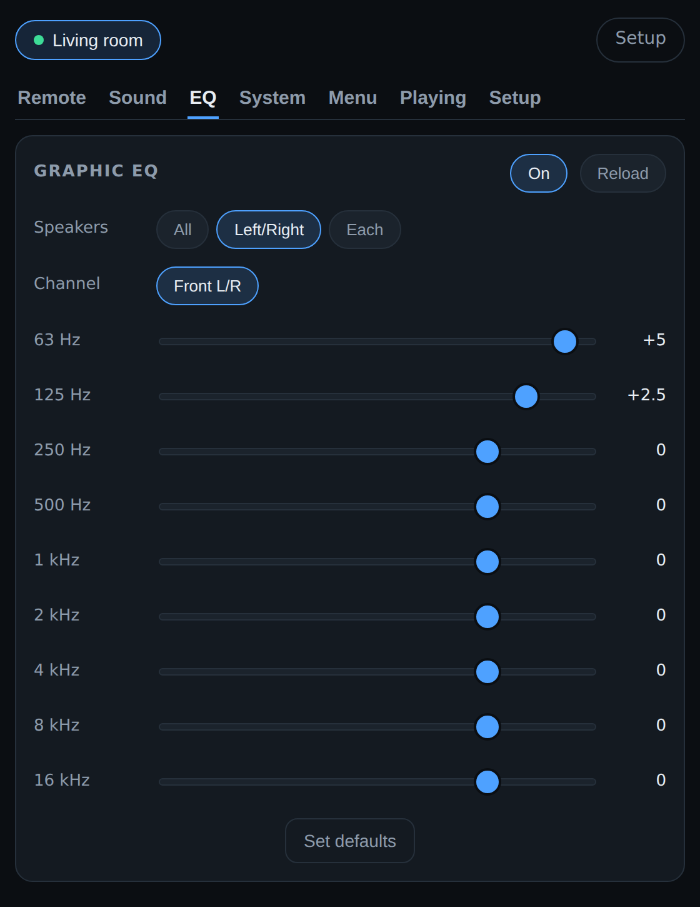
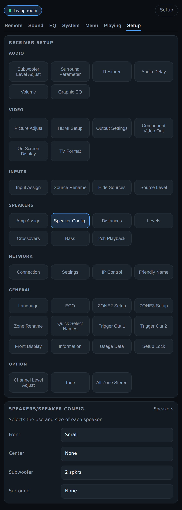
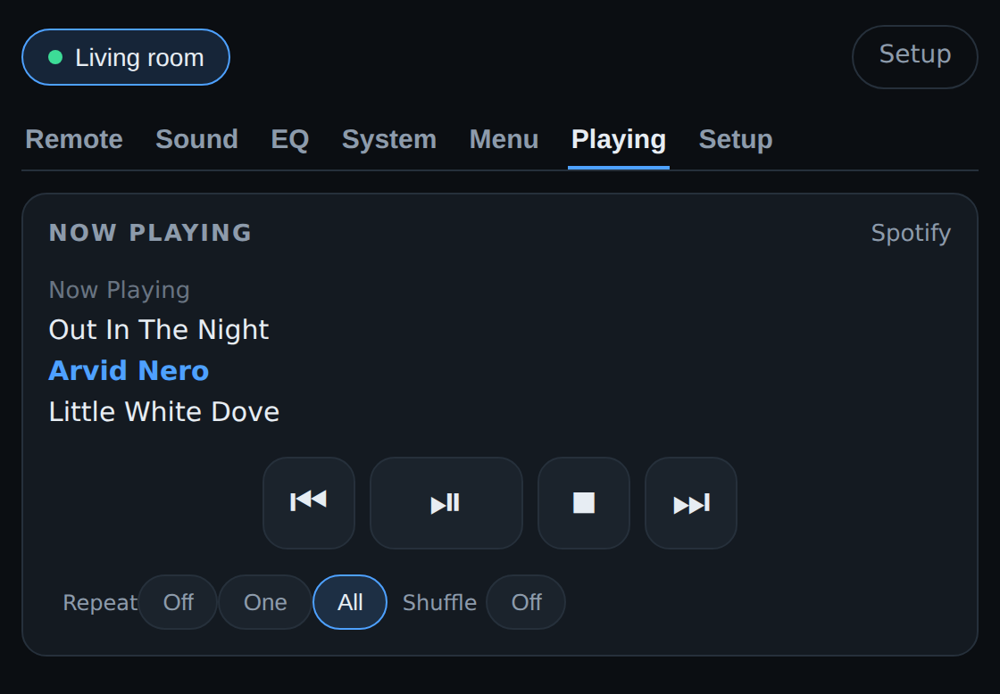

# Denon Remote

A fast replacement for the web interface built into Denon AVR receivers — for the
**AVR-X4100W** and **AVR-X2500H**, and anything speaking the same control protocol.

The receivers' own page does a full HTTP round trip per action and re-reads the whole
status document each time. This keeps the control socket open instead, so a tap is a
few bytes on a connection that is already up, and changes made from the physical
remote or the front panel appear here immediately.

Blazor Server on .NET 8. No account, no cloud, nothing leaves the network.



## Running it

```bash
dotnet run
```

Open <http://localhost:5080>. It listens on `0.0.0.0:5080`, so from a phone on the same
wifi use `http://<your-machine>.local:5080`. Add it to the home screen on iOS and it
opens full-screen.

On first run: **Setup → Scan for receivers**, or add an IP by hand if your network
blocks SSDP. Receivers and scenes live in `~/.denonremote/`.

Builds that need no .NET installed are attached to each
[release](../../releases) for macOS, Windows and Linux, on both Intel and ARM.

## What it does

**Remote** — power, volume, mute, inputs and sound mode, per zone. Zone 2 and Zone 3
appear only if the receiver has them. Input names, zone names and Quick Select names
come from the unit itself, so the grid shows what you named things and hides inputs
you deleted. Quick Select 1–4 are the receiver's own slots; scenes are app-side presets
that set input, volume, sound mode and the other zones together — something the
hardware can't do.

**Sound** — the settings buried deepest in the on-screen menu: tone, channel trims,
Audyssey, Dynamic Volume, Restorer, and the full Surround Parameter menu. The app asks
about all of them and shows the ones this receiver answered for, so what you see
applies to your setup.



**EQ** — the 9-band graphic EQ. This is not in Denon's published control protocol, nor
in Home Assistant's `denonavr` integration; each generation drives it from its own
setup UI over HTTP, and both mechanisms were read off the receivers rather than
guessed. See [docs/protocol.md](docs/protocol.md).



**Setup** — the receiver's own configuration, read live and shown in its own words:
amp assign, speaker config, distances, levels, crossovers, HDMI, input assign, zone
setup, and the rest. The menus, their order and their names come from the receiver
each time rather than from a list kept here, so a unit with settings this one has
never seen shows them anyway.



**Playing** — now playing and transport. The X2500H has HEOS; the X4100W predates it
and is driven through the interface its own web UI uses.
A HEOS-only speaker or link has no receiver to remote, so it gets just this tab, with
volume and mute added. That path has not been tried on real hardware.



**System**, **Menu**, **Tuner** — ECO mode, dimmer, auto-standby, HDMI routing; the
cursor pad for the on-screen menus; frequency and presets while the tuner is selected.

**Guardrails** — a per-receiver volume ceiling nothing can exceed, a confirm step for
a big slider jump, a sleep timer, and a night mode.

**Protocol console** — send any raw command and watch both directions live. This is
the tool for working out commands that aren't in the protocol document.

## A few things worth knowing

Every phone, tablet and laptop looking at the app shares one socket per receiver and
sees the same live state, which also sidesteps the receivers' limit on concurrent
control connections.

Every command verifies itself. The receiver answers a command it accepted and stays
silent on one it doesn't support, so each change is followed by a query. A command
that goes unanswered is reverted in the UI and reported as unsupported rather than
sitting there looking applied.

The app never guesses on the receiver's behalf. Where it can read something from the
unit — names, menus, allowed values, which settings apply — it does, and where the
unit won't say, it says so instead of inventing a default.

Volume is shown as the number on the receiver's front panel.

## Documentation

* [docs/protocol.md](docs/protocol.md) — the undocumented HTTP interfaces: the graphic
  EQ on both generations, the setup API, the pre-HEOS network player, and how they
  were found.
* [docs/maintaining.md](docs/maintaining.md) — building and releasing, the layout of
  the source, the self-test, and the things that will bite whoever touches this next.

## Status

Runs against both receivers on a home network. Checks:

```bash
dotnet run -- --self-test
```

273 checks over the parts that have actually had bugs — protocol parsing, command
encoding, both graphic-EQ payload shapes, the setup API's XML, the network player's
two screen modes, and the request pacing. It's a flag on the app rather than a test
project, so it needs no packages and runs anywhere the app runs; the publish script
and the release workflow both run it before building.

Beyond that the app is driven through a headless browser against stand-ins that speak
the control protocol, the HEOS command line and the HTTP endpoints — including the
real captured setup pages from both receivers.
